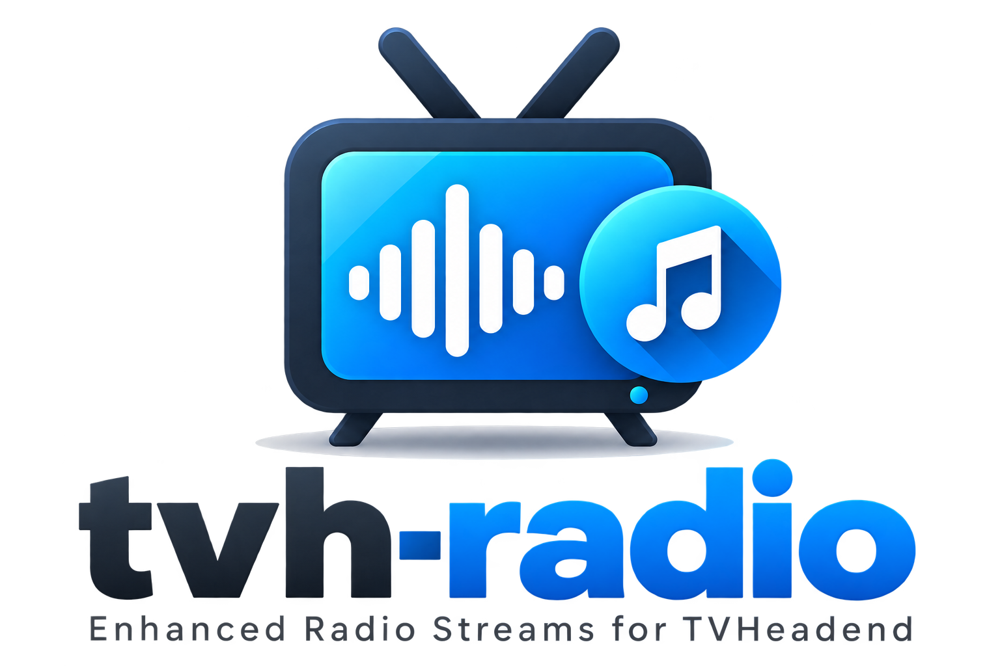

<a id="readme-top"></a>
<div align="center">



Turn almost any iHeartRadio internet radio stream into TVHeadend-compatible live channels.

<br />

[![contributors][badge-contributors]][contributors]
[![last update][badge-last-commit]][last-commit]
[![open issues][badge-issues]][issues]
[![forks][badge-forks]][forks]
[![stars][badge-stars]][stars]

#### [Documentation][documentation] · [Report Bug][report-bug] · [Request Feature][request-feature]

</div>

<br />

<!-- Table of Contents -->
<details>
<summary>Table of Contents</summary>
<hr />

- [About the Project](#about-the-project)
  - [Introduction](#introduction)
  - [Features](#features)
  - [Architecture](#architecture)
- [Getting Started](#getting-started)
  - [Prerequisites](#prerequisites)
  - [Installation](#installation)
  - [Deployment](#deployment)
- [Usage](#usage)
- [Roadmap](#roadmap)
  - [Monitoring and operations](#monitoring-and-operations)
  - [Runtime management](#runtime-management)
  - [Streaming and metadata](#streaming-and-metadata)
  - [Display and presentation](#display-and-presentation)
  - [Code quality and maintainability](#code-quality-and-maintainability)
- [Contributing](#contributing)
  - [Top contributors:](#top-contributors)
  - [Code of Conduct](#code-of-conduct)
- [FAQ](#faq)
  - [Does tvh-radio replace TVHeadend?](#does-tvh-radio-replace-tvheadend)
  - [Can UDP ports be assigned automatically?](#can-udp-ports-be-assigned-automatically)
  - [Can channel numbers be assigned automatically?](#can-channel-numbers-be-assigned-automatically)
  - [What happens if a metadata service goes offline?](#what-happens-if-a-metadata-service-goes-offline)
  - [What happens if artwork is unavailable?](#what-happens-if-artwork-is-unavailable)
  - [Where should I look when something is not working?](#where-should-i-look-when-something-is-not-working)
- [License](#license)
- [Acknowledgements](#acknowledgements)
  - [AI-Assisted Development](#ai-assisted-development)

</details>
<br />

<!-- About the Project -->
## About the Project

<!-- Introduction -->
### Introduction

`tvh-radio` turns internet radio streams into live MPEG-TS channels that can be consumed by TVHeadend.

Each configured radio station is handled by its own streamer process. The streamer retrieves the station's audio, metadata and artwork, generates a now-playing image, combines the generated video with the audio using GStreamer, and outputs an MPEG-TS stream over UDP.

A master process manages the individual streamers, monitors their health and automatically restarts failed channels according to the configured restart policy.

The project is designed for people who want to make internet radio stations available through a TVHeadend installation, including setups where those channels are then consumed by DVR or media-centre software.

<p align="right">(<a href="#readme-top">back to top</a>)</p>

<!-- Features -->
### Features

- Convert internet radio streams into TVHeadend-compatible MPEG-TS channels.
- Generate now-playing video from station metadata and artwork.
- Combine generated H.264 video with AAC audio using GStreamer.
- Output each channel as MPEG-TS over UDP.
- Support multiple radio channels from a single master process.
- Automatically allocate UDP ports when explicit ports are not configured.
- Generate an M3U playlist for TVHeadend IPTV Automatic Network configuration.
- Include channel numbers, names, logos and TVHeadend tags in the generated playlist.
- Handle temporary metadata API failures and HTTP 204 responses.
- Provide fallback metadata and artwork.
- Retry unavailable station logos.
- Recover from temporary audio/Icecast failures.
- Monitor streamer processes and restart failed channels.
- Detect repeated restart failures and use configurable backoff.
- Shut down streamers cleanly.
- Provide configuration validation with a dry-run mode.
- Include an iHeartRadio extractor to help create channel configurations from supported iHeartRadio station pages.

<p align="right">(<a href="#readme-top">back to top</a>)</p>

### Architecture

The application is split into a master process and individual channel streamers:

```text
                         +----------------+
                         |   master.py    |
                         | process manager|
                         +-------+--------+
                                 |
                 +---------------+---------------+
                 |               |               |
                 v               v               v
          +------------+   +------------+   +------------+
          | streamer   |   | streamer   |   | streamer   |
          | channel A  |   | channel B  |   | channel C  |
          +-----+------+   +-----+------+   +-----+------+
                |                |                |
                v                v                v
          MPEG-TS/UDP       MPEG-TS/UDP       MPEG-TS/UDP
                |                |                |
                +----------------+----------------+
                                 |
                                 v
                            TVHeadend
```

The master handles configuration, UDP allocation, playlist generation, process monitoring, restart/recovery and shutdown. Each streamer handles one channel's audio, metadata, artwork, image generation, GStreamer pipeline and MPEG-TS output.

<p align="right">(<a href="#readme-top">back to top</a>)</p>

<!-- Getting Started -->
## Getting Started

The quickest way to get started is:

1. Install the required system dependencies.
2. Clone the repository.
3. Create a Python virtual environment using the system GStreamer/PyGObject packages.
4. Install the Python dependencies.
5. Create one or more channel configurations.
6. Validate the configuration.
7. Start `tvh-radio`.
8. Configure TVHeadend to consume the generated UDP streams or M3U playlist.

An iHeartRadio extractor is included under `iheart_extract/`. It can inspect a supported iHeartRadio station page and extract information useful for creating a channel configuration.

See [Installation][installation] for the complete setup procedure.

<p align="right">(<a href="#readme-top">back to top</a>)</p>

<!-- Prerequisites -->
### Prerequisites

`tvh-radio` requires:

- Linux
- Python 3
- GStreamer 1.x
- GStreamer plugins required for H.264, AAC and MPEG-TS processing
- PyGObject / GObject Introspection
- Python packages listed in `requirements.txt`

The recommended virtual environment uses the system-installed GStreamer/PyGObject packages:

```bash
python3 -m venv .venv --system-site-packages
source .venv/bin/activate
pip install -r requirements.txt
```

See [Installation][installation] for the complete dependency and setup procedure.

<p align="right">(<a href="#readme-top">back to top</a>)</p>

<!-- Installation -->
### Installation

Clone the repository:

```bash
git clone https://github.com/johnstray/tvh-radio.git
cd tvh-radio
```

Create and activate the virtual environment:

```bash
python3 -m venv .venv --system-site-packages
source .venv/bin/activate
```

Install the Python dependencies:

```bash
pip install -r requirements.txt
```

Create a channel configuration in `channels/`, using one of the examples in `examples/channels/`.

Before starting the service, validate the configuration:

```bash
python master.py --validate
```

See [Installation][installation], [Configuration][configuration] and [Channels][channels] for the complete instructions.

<p align="right">(<a href="#readme-top">back to top</a>)</p>

<!-- Deployment -->
### Deployment

For normal long-running operation, `tvh-radio` should be run as a systemd service.

The repository includes a systemd service template under `systemd/`.

A typical installation uses:

```bash
sudo systemctl enable tvh-radio
sudo systemctl start tvh-radio
```

Check the service with:

```bash
sudo systemctl status tvh-radio
```

View logs with:

```bash
journalctl -u tvh-radio -f
```

See [Installation][installation] and [Operation][operation] for the complete deployment and service-management procedures.

<p align="right">(<a href="#readme-top">back to top</a>)</p>

<!-- Usage -->
## Usage

Validate configuration before starting:

```bash
python master.py --validate
```

For development or testing, run the master directly:

```bash
python master.py
```

Channel configurations are stored in `channels/`. Examples are provided in `examples/channels/`.

A channel's UDP output can be tested independently with:

```bash
mpv udp://127.0.0.1:1234
```

TVHeadend can consume the channels individually through IPTV muxes or through the generated M3U playlist using an IPTV Automatic Network.

See [Operation][operation], [TVHeadend Integration][tvheadend-integration] and [Troubleshooting][troubleshooting].

<p align="right">(<a href="#readme-top">back to top</a>)</p>

<!-- Roadmap -->
## Roadmap

`tvh-radio` 1.0.0 provides the stable foundation for running internet radio streams as TVHeadend channels. Future development will focus on making the system more flexible, easier to monitor and operate, and less dependent on specific streaming providers.

Planned work includes:

### Monitoring and operations

- **Status and health API** — expose machine-readable master and per-channel health, runtime state, audio/metadata status, restart information, UDP endpoints, and useful error information.
- **Zabbix-oriented monitoring** — provide stable metrics and an integration path for Zabbix and other external monitoring systems.
- **Richer command-line diagnostics** — add commands for validation, channel listings, runtime status, and diagnostics without requiring users to inspect configuration files or logs directly.

### Runtime management

- **Demand-based streaming** — allow channels to run on demand rather than continuously, with configurable idle grace periods and per-channel `on-demand` / `always-on` modes.
- **Configuration hot-reload** — detect channel configuration changes and safely add, remove, or update channels without restarting the master process, while keeping the generated playlist synchronised.

### Streaming and metadata

- **Audio source abstraction** — separate audio source handling from the core streamer so Icecast is one implementation rather than a hard-coded dependency.
- **Additional audio source types** — add support for other suitable audio input methods once the source abstraction is in place.
- **Generalised metadata sources** — separate metadata acquisition from the streamer so providers other than iHeart can be supported.
- **Configurable JSON metadata mapping** — allow channel configurations to describe how artist, title, album, artwork, and other fields are extracted from JSON metadata responses.

### Display and presentation

- **Startup and status images** — provide meaningful video while channels are starting, reconnecting, waiting for metadata, or otherwise temporarily unavailable.
- **Configurable/custom layouts** — investigate and potentially implement alternative now-playing layouts without coupling layout definitions to the core streaming logic.

### Code quality and maintainability

- **Formal channel configuration schema** — define the configuration structure, required and optional fields, valid values, and validation rules in a more formal and maintainable way.
- **Streamer architecture refactor** — split the streamer into smaller components with clearer responsibilities while preserving the existing streaming, recovery, logging, and shutdown behaviour.
- **Automated test suite** — add automated coverage for configuration validation, UDP allocation, playlist generation, metadata handling, fallback behaviour, and other core functionality, reducing reliance on manual regression testing.

These items are tracked as GitHub issues and may be developed independently as the project evolves. The roadmap is intentionally not tied to a fixed release schedule; features may be added, changed, or reprioritised as real-world usage provides feedback.

## Contributing

Contributions are welcome.

Before making a significant change, check the existing issues and documentation to see whether the work is already planned.

Please keep the separation between `master.py` and `streamer.py` in mind: the master is responsible for orchestration and process management, while channel-specific streaming functionality belongs in the streamer.

See [Development][development] for the development workflow and testing guidance.

1. Fork the Project
2. Create your Feature Branch (`git checkout -b feature/AmazingFeature`)
3. Commit your Changes (`git commit -m 'Add some AmazingFeature'`)
4. Push to the Branch (`git push origin feature/AmazingFeature`)
5. Open a Pull Request

### Top contributors:

<a href="https://github.com/johnstray/tvh-radio/graphs/contributors">
  
</a>

<p align="right">(<a href="#readme-top">back to top</a>)</p>


<!-- Code of Conduct -->
### Code of Conduct

Please read the [Code of Conduct][code-of-conduct]

<p align="right">(<a href="#readme-top">back to top</a>)</p>

<!-- FAQ -->
## FAQ

### Does tvh-radio replace TVHeadend?

No. `tvh-radio` provides IPTV/MPEG-TS streams for TVHeadend. TVHeadend remains responsible for receiving streams, discovering services, mapping channels and providing them to clients.

### Can UDP ports be assigned automatically?

Yes. A channel can omit `udp_port` and allow the master to allocate a port from the configured UDP range.

### Can channel numbers be assigned automatically?

Yes. A channel can omit `channel_number` and allow the master to allocate a channel number according to the configured playlist settings.

### What happens if a metadata service goes offline?

The streamer uses its configured fallback behaviour. Temporary empty responses can retain the existing now-playing image, while sustained empty responses or other metadata failures can result in fallback metadata being displayed.

### What happens if artwork is unavailable?

Configured fallback artwork is used. Station logos also have a primary, configured fallback and generic fallback path.

### Where should I look when something is not working?

Start with:

```bash
python master.py --validate
journalctl -u tvh-radio -f
```

If the streamer is running, test its UDP output independently with `mpv` before investigating TVHeadend.

See [Troubleshooting][troubleshooting].

<p align="right">(<a href="#readme-top">back to top</a>)</p>

<!-- License -->
## License

Distributed under the OSL-3.0 License. See [LICENSE.md][license] for more information.

<p align="right">(<a href="#readme-top">back to top</a>)</p>

<!-- Acknowledgments -->
## Acknowledgements

`tvh-radio` makes use of open-source projects and libraries including:

- [Python][python]
- [GStreamer][gstreamer]
- [Pillow][pillow]
- [Requests][requests]
- [Beautiful Soup][beautiful-soup]
- [Shields.io][shields-io]

The project also uses the official [TVHeadend documentation][tvheadend-documentation] as a reference for integration.

<p align="right">(<a href="#readme-top">back to top</a>)</p>

<!-- AI-Assisted Development -->
### AI-Assisted Development

This project has been developed with assistance from AI tools, including ChatGPT. AI has been used for architectural discussion, code development and review, troubleshooting, documentation, and testing suggestions.

All AI-generated suggestions and code are reviewed, tested, and adapted before being incorporated into the project. The project maintainer remains responsible for the final implementation, design, testing, and content.

---

[badge-contributors]: https://img.shields.io/github/contributors/johnstray/tvh-radio
[contributors]: https://github.com/johnstray/tvh-radio/graphs/contributors
[badge-last-commit]: https://img.shields.io/github/last-commit/johnstray/tvh-radio
[last-commit]: https://github.com/johnstray/tvh-radio/commits/main
[badge-forks]: https://img.shields.io/github/forks/johnstray/tvh-radio
[forks]: https://github.com/johnstray/tvh-radio/network/members
[badge-stars]: https://img.shields.io/github/stars/johnstray/tvh-radio
[stars]: https://github.com/johnstray/tvh-radio/stargazers
[badge-issues]: https://img.shields.io/github/issues/johnstray/tvh-radio
[issues]: https://github.com/johnstray/tvh-radio/issues/
[license]: LICENSE.md
[documentation]: docs/installation.md
[report-bug]: https://github.com/johnstray/tvh-radio/issues/
[request-feature]: https://github.com/johnstray/tvh-radio/issues/
[installation]: docs/installation.md
[configuration]: docs/configuration.md
[channels]: docs/channels.md
[operation]: docs/operation.md
[tvheadend-integration]: docs/tvheadend.md
[troubleshooting]: docs/troubleshooting.md
[development]: docs/development.md
[code-of-conduct]: https://github.com/johnstray/.github/blob/main/CODE_OF_CONDUCT.md
[python]: https://www.python.org/
[gstreamer]: https://gstreamer.freedesktop.org/
[pillow]: https://python-pillow.org/
[requests]: https://requests.readthedocs.io/
[beautiful-soup]: https://www.crummy.com/software/BeautifulSoup/
[shields-io]: https://shields.io/
[tvheadend-documentation]: https://docs.tvheadend.org/
